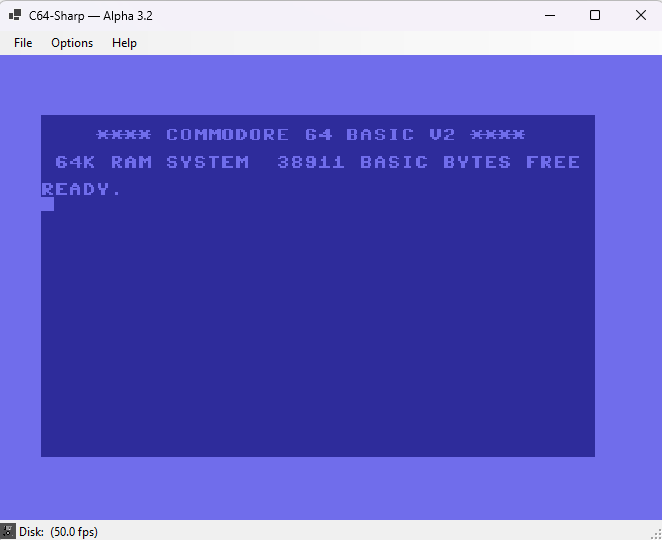

# C64-Sharp — a Commodore 64 emulator in C#

A from-scratch C64 emulator in C#, developed using Muse AI. Successfully
boots original KERNAL and BASIC ROMs with disk loading support; audio
implementation is currently in progress.



## Recent improvements

- **Sound.** The SID was rewritten with reSID-style accuracy: real ADSR
  envelopes (with the authentic hardware delay quirk), combined waveforms,
  per-voice noise, hard sync, ring modulation, and a resonant
  lowpass/bandpass/highpass/notch filter. No more beeps — it sings.
- **Joystick.** Keyboard (numpad) joystick input was fixed with
  real-hardware CIA Port A behavior, and USB gamepads now work through a
  Raw Input + HID path — including pads Windows only exposes to
  DirectInput, which the legacy joystick API can't see. A live **Test**
  dialog on the Joystick settings tab shows exactly what the C64 sees on
  Port 2, so mapping buttons takes seconds.

## Layout

```
src/C64.Core/            Emulator core (no UI dependencies)
  Cpu/Cpu6510.cs         6510 CPU: fetch/decode/execute, flags, stack, IRQ/NMI
  Memory/C64Bus.cs       C64 memory map: PLA banking, ROMs, color RAM, I/O area
  Vic/VicIi.cs           VIC-II: text/bitmap modes, sprites, raster IRQ (PAL)
  Cia/                   6526 CIAs, keyboard matrix, IEC controller glue
  Sid/Sid.cs             SID: 3 voices, ADSR envelopes, ring mod, filter
  Disk/HleDrive.cs       HLE 1541: traps Kernal LOAD ($FFD5), serves .d64 files
  Disk/                  D64 reader, GCR codec, VIA6522, IEC bus (DOS path)
app/C64Sharp/            Windows (WinForms) app: screen, keyboard, waveOut
                         sound, USB joystick, settings, disk mounting
tests/C64.Core.Tests/    xUnit tests — tiny hand-assembled programs
demo/                    BouncingBall, VicBoot, VicTerm, VicBitmap, SidTune,
                         KeyTest — run with: dotnet run --project demo/<name>
tools/DormannTest/       Klaus Dormann 6502 functional-test runner
```

## Build & test

Prerequisites: the [.NET 8 SDK](https://dotnet.microsoft.com/download).
The core library and tests build anywhere; the Windows app
(`app/C64Sharp`, `net8.0-windows`) must be built on a Windows machine.

```sh
dotnet build C64Sharp.sln        # core + tests + demos (any OS)
dotnet test                      # xUnit suite for the core
dotnet build C64Sharp.App.sln    # Windows app (Windows only)
```

There are no third-party NuGet dependencies — a plain
`dotnet restore` from nuget.org is all that's needed. (If you open the
solutions in Visual Studio, just Build; the exe lands in
`app/C64Sharp/bin/Release/net8.0-windows/`.)

### ROMs

The emulator needs the three original Commodore 64 ROMs (8 KB each).
They are copyrighted and are **not** in this repo — bring your own legal
copy, e.g. from [C64 Forever](https://www.c64forever.com/):

| File          | Contents                    |
|---------------|-----------------------------|
| `basic.rom`   | BASIC interpreter (901226)  |
| `kernal.rom`  | Kernal (901227)             |
| `chargen.rom` | Character generator (901225)|

**For the Windows app:** put the three files in a `.roms` folder next to
the exe (`app/C64Sharp/bin/Release/net8.0-windows/.roms/`), or pick
custom locations in the app under Options → Settings → ROMs (saved to
`config\settings.json` next to the exe). If the ROMs are missing when the
app starts, it opens the Settings dialog on the ROMs tab and walks you
through selecting them.

**For tests/demos/tools:** drop the same three files in the `.roms/`
folder at the repo root (also gitignored).

## Roadmap

- [x] **M1 — CPU core bring-up.** Registers, flags, stack, ~40 opcodes,
      hand-written tests.
- [x] **M2 — Full 6502, validated.** All 151 standard opcodes and
      addressing modes are implemented (loads/stores/ALU/logic/shifts/
      BIT/branches/JSR/RTS/JMP indirect incl. the page-wrap bug), plus
      decimal-mode (BCD) ADC/SBC and real BRK/RTI interrupt handling.
      **Klaus Dormann's 6502 functional test suite passes clean**
      (success trap $3469 after 30.6M instructions / 95.3M cycles).
      Bouncing-ball demo (`demo/BouncingBall`) plus a headless
      integration test that runs the demo's program for 120 frames.
- [x] **M3 (bus) — Memory map.** PLA banking via the 6510's $0000/$0001
      port, Kernal/BASIC/character ROMs, 1KB of 4-bit color RAM, and the
      $D000-$DFFF I/O area: `C64Bus` (`src/C64.Core/Memory`) implements it
      all, backed by 11 unit tests (banking configs, RAM-under-ROM, color
      RAM nibbles, CPU port behavior incl. the PEEK(1)=55 quirk). The I/O
      chips: the VIC-II is a functional text-mode implementation (M4), the
      SID and CIAs are register stubs with write storage (real ones arrive
      in M5/M7).
- [x] **M3 (ROMs) — Real ROMs.** Verified with a licensed C64 Forever
      set: BASIC (901226-01) and CHAROM (901225-01) match known-good hashes,
      the Kernal's NMI/RESET/IRQ vectors read $FE43/$FCE2/$FF48 through the
      banking, and the CPU resets to $FCE2. ROMs are never shipped with the
      repo — drop yours in the gitignored `.roms/` folder and construct
      `new C64Bus(File.ReadAllBytes(".roms/basic.rom"), ...)`.
- [x] **M4 — VIC-II (text mode).** `VicIi` (`src/C64.Core/Vic`) implements
      the 6569: 64 mirrored registers, PAL raster (63 cycles/line, 312 lines)
      driven from the CPU cycle count, the $D019 raster latch, VIC-banked
      memory (screen RAM + CHAROM at $1000/$9000 + direct color RAM), and a
      384x272 text-mode renderer. Boots the real Kernal to a pixel-perfect
      `READY.` — banner, 38911 bytes free, 40-column mode. 43/43 tests green.
- [x] **M5 — CIA + input.** `Cia6526` (`src/C64.Core/Cia`) implements timers
      A/B (one-shot/continuous, Timer B counting Timer A), the $0D interrupt
      control register (mask + flags, IRQ output), and the I/O ports with DDR.
      CIA1's Port B reads the `KeyboardMatrix` (8x8, transcribed from the
      Kernal's $EB81 decode table). The CPU gained hardware IRQ/NMI
      (`IrqLine` polled per instruction). The real Kernal's 60 Hz system IRQ
      drives the keyboard scan — you can type `PRINT 2+2` at the prompt.
      `demo/VicTerm` is an interactive terminal: `dotnet run --project
      demo/VicTerm`. 51/51 tests green.
- [x] **M6 — VIC-II (graphics).** All modes (standard/multicolor text and
      bitmap, ECM), 8 sprites with collision, raster IRQ. Verified by typing
      a BASIC program that switched to bitmap mode live. 57/57 tests green.
- [x] **M7 — SID.** 3 voices with 24-bit phase accumulators
      (triangle/saw/pulse/noise), 15-bit ADSR envelopes, ring modulation,
      and a simplified filter. `demo/SidTune` writes a real `tune.wav`.
      62/62 tests green.
- [x] **M8 — Windows app + HLE 1541.** WinForms app at full 50 fps PAL:
      keyboard (incl. arrows/F-keys/RESTORE), waveOut sound, numpad + USB
      joystick, settings screen, status bar with blinking drive LED.
      `HleDrive` traps Kernal LOAD ($FFD5) and serves `.d64` images directly
      — standard `LOAD"$",8` / `LOAD"file",8` work. (The real-1541 DOS ROM
      path was deferred: its read loop needs the 6502 SO pin, so fastloaders
      and copy-protected disks won't load.)
- [ ] **M9 — Polish.** Cycle-exact timing, save states, debugger UI.

## Design notes

- The CPU never touches memory directly — everything goes through
  `IMemoryBus`. That seam is what makes M3 a contained change.
- Cycle counts are base values for now; page-cross penalties and VIC-II
  cycle stealing come with the VIC-II milestone.
- `BRK` performs the real hardware interrupt sequence (pushes PC+2 and
  status with B set, sets I, jumps to `($FFFE)`); `RTI` restores state.
  `$02` (JAM, an illegal opcode) doubles as the halt instruction for our
  own test programs.

## CPU validation

`tools/DormannTest` is a headless runner for
[Klaus Dormann's 6502 functional test suite](https://github.com/Klaus2m5/6502_65C02_functional_tests)
(GPL-3.0). The test binary is not shipped with this repo — download
`bin_files/6502_functional_test.bin` yourself, then:

```
dotnet run --project tools/DormannTest -- <path to 6502_functional_test.bin>
```

It loads the 64KB image at $0000, starts at $0400, and runs until the PC
stops advancing on a trap: `$3469` means every subtest passed, any other
trap address is a failure (look it up in the upstream `.lst` file).

## References

- [6502.org](http://www.6502.org/) — tutorials and forums
- [C64 Wiki](https://www.c64-wiki.com/) — memory map, chip docs
- [Klaus Dormann's 6502 functional tests](https://github.com/Klaus2m5/6502_65C02_functional_tests)
- "Mapping the Commodore 64" — the memory map bible
